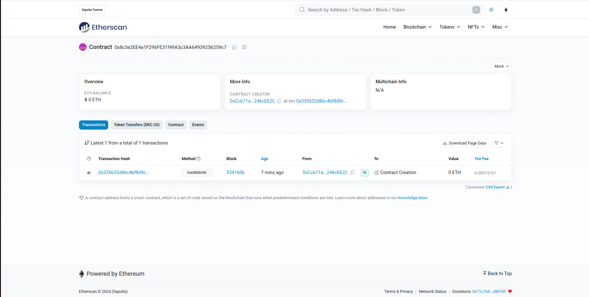

# 2024-Spring-HW0

All the detailed specified in Homework 0 documentation.

## Wallet Address
Please provide your MetaMask wallet address: 0xCcb71aac7F6864Ac9B175D450eb9f93B246cE62C

## Local Testing
Please provide a screenshot of the `forge test -vvv` command running in your local environment.

## Contract Address
Please provide the contract address that you deployed on the Sepolia network.
0x8c3e2EE4a1F296FE31f49A3c3AA64939256259c7

## Sepolia Etherscan
Paste the contract address into the Sepolia Etherscan and share the screenshot.

